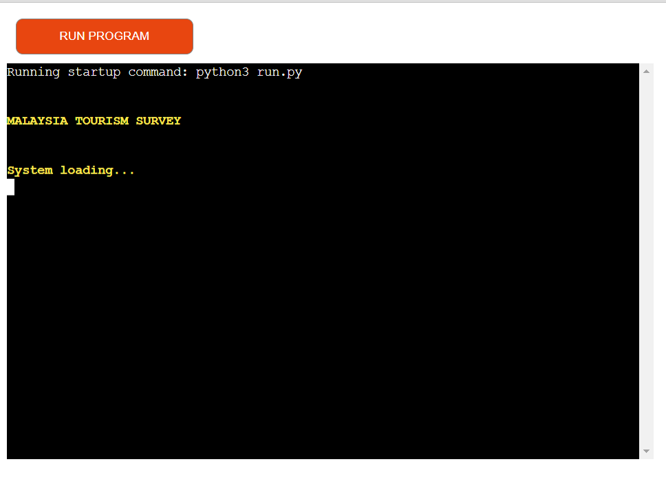
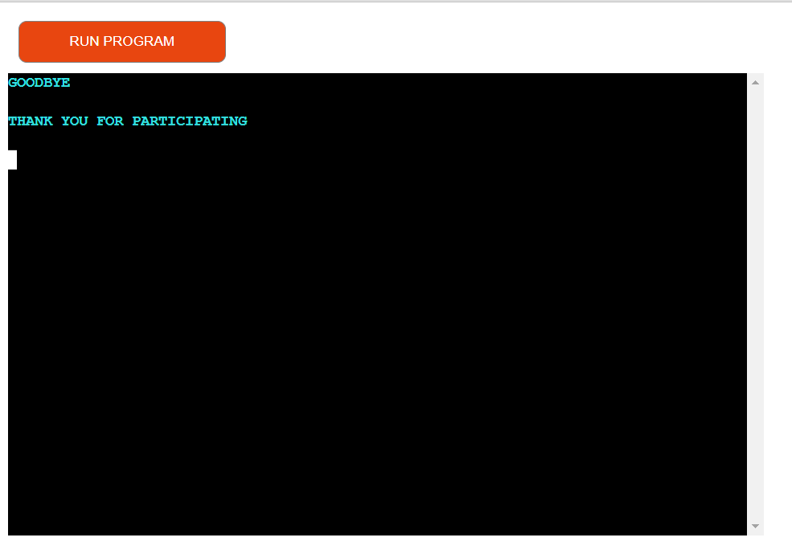

# Tourism Survey
Developer: Grace

Tourism Survey is a project configure using python, there are question and answer options where the result will be append link to Google spreadsheet. There are text messages retrieved from Google spreadheet and all these are through Google API connect link between two programm - Python and Google spreadsheet. 

To view the project click [here](https://tourism-survey-02c2e85cb97f.herokuapp.com/).

## Table of Contents
1.	User Experience (UX)
	-   Project Goals
	-   User Stories
	-   Typography
	Wireframes
2.	Design
	-   Typography
	-   Wireframes
    -   Features
3.	Techologies Used
    -    Languages Used
    -    Frameworks, Libraries & Programs Used
4.	Testing
o	W3C Validator
o	Accessibility
o	Home Page
o	Menu Page
o	Gallery Page
o	Contact Us Page
o	Sign Up Page
o	Tools Testing
o	General Testing
5.	Finish Products
o	Home Page
o	Menu Page
o	Gallery Page
o	Contact Us Page
o	Sign Up Page
6.	Deployment
o	GitHub Pages
7.	Credits
o	Content
o	Code
o	Acknowledgments
 
# User Experience (UX)

## Project Goals
- Collect user demographic information.
- Collect user answer for the survey.
- Store the result data in Google spreadsheet.
- Show the questions and answer options.
- To validate that the Google API link between two program here, Python and Google spreadsheet.

## User stories

- As a user I would like to understand the purpose of the survey.
- As a user I would like to choose whether to take the survey or not.
- As a user I would like to have an option to choose from the answer.
- I might have a typo error when enter the choose number, as a user I would like to be inform and try again.
- As a user I would like to have an option to submit the survey or not.
- As a user I would like to have an option to choose to confirm exit or change my mind to take the survey.

## Data Model

- This program uses Google sheet to retrieve text information and to store result from the survey.

- The welcome message and the goodbye message are store in the Google sheet.

- The user_choice variable is use to store data in the Google sheet.

- This is the Google sheet used to stored text message

- This is the Google sheet used to stored survey results.

## Flowchart

I use [Diagrams](https://app.diagrams.net/) to create flowchart for my project. 

Back to [Table of Contents](#table-of-contents)

# Features

## Title Screen

- This screen show the welcome home page with system loading message informing user to wait during the process

- The below two screeshot are welcome meassage screen with introductory about the survey.
- User have press enter to continue to the next screen.

## Option

- This screen gives the user to choose to 
    - Take the survey
    - No and Exit

## Taking the Survey

- This part of the program shows the questions and the answer options for the user to choose.
- User have to enter their choice number at "Enter your choice" and below will show the answer which the user have choose.
- If the user choose the number which is out of the range red warning message "Invalid input! Please try again" will print out and the message "Enter your choice" will print out again for the user to retype their correct choice.

- Question 1

- Question 2

- Question 3

- Question 4
- This screenshot have an example of invalid input when the user type in the out of range choice.

- Question 5

- Question 6
- This screenshot have an example of invalid input when the user type in the out of range choice.

- Question 7

- Question 8

- Question 9

- Question 10

- Question 11

Back to [Table of Contents](#table-of-contents)

- User can choose to submit the survey or exit without submit the survey.
- If the user choose submit a message "You choose to submit the survey" will print out.
- After that follow by the exit screen to show finished submitting.

- The exit screen allow the user to confirm if they want to exit or back to take the survey.

- When user choose "yes" to exit, a goodbue message will print out.

Back to [Table of Contents](#table-of-contents)

# Technologies Used

## Languages
- Python

## Frameworks, Libraries and Programmes

-   [Gspread](https://docs.gspread.org/en/v5.7.0/) is the API for Google sheets use to store survey data.

- 	[Colorama](https://pypi.org/project/colorama/) is use to style the text with color to improve UX and readability.

-   [Codeanywhere](https://app.codeanywhere.com/) is use to write, commit and push the code to GitHub.

-	[GitHUb](https://github.com/) is the platform that used to store and manage the codes.

-	[Heroku](https://dashboard.heroku.com/apps) is a platform as a service (PaaS) that was used to host and deploy the finished project.

# Testing

- As a user, I would like to understand the program purpose.
    - The home page show the message "Malaysia Tourism Survey" show that this survey is about Malaysia tourism.
    - The welcome message and introductory have explained that the survey is conduct for use to improve the country tourism.

- As a user, I would like to be able to choose whether to take the survey or exit the program.
    - The menu have the option to "Take the survey" or "No and Exit".

- As a user, I would like to be able to choose an answer from the options.
    - There are few option in each question.
    - Invalid input will print out if the number key in is out of range.

- As a user, when finished answered all the question, I would like to have an option to choose to submit the survey or to choose to change my mind and exit.
    - The submit option when choose will print out "You choose to Submit the survey" to show that you have choose to submit your survey.
    - The Exit option when choose will bring you to the next screen to ask you to confirm whether you want to exit.

Back to [Table of Contents](#table-of-contents)

## Code Validation

- [CI Python Linter](https://pep8ci.herokuapp.com/) :
    - This PEP8 tool provided by Code Institute was used for validated the code for the project.

- There are some error show when validated the code:
    - Trailing whitespace.
    - Line too long.
    - Continuation line under-indented for visual indent.
    - Blank line contain whitespace.

- After the error resolve, the code was validated again.
- The results show all clear and no error founds.

# Feature Testing

# Bugs

- There is a problem with the data append into the worksheet. All the result was appended in one column instead of in one row according to the column.
- Not yet resolve.

- After the message "You have selected: {Choose answer}" the cursor will go down next line. When accidentally press a number in the cursor place, it will consider answering the next question which give user no option to select an answer for the next question.
- This was resolve by remove the time.sleep() from all th question.

# Deployment

This program was developed using Visual Studio Code in Codeanywhere. The finished project was deployed in Heroku and display using Code Institute Python Terminal.

The steps used to deployed in Heroku are:

1. Run "pip3 freeze > requirements.txt" in the terminal
    - This is to add a list of dependencies to requirements.txt
2. Commit and push to GitHub.
3. Login to [Heroku](https://dashboard.heroku.com/apps).
4. From the dashboard, open new App and create new App name.
5. Next go to setting and click on Config Vars 
    - This is to store sensitive data that need to be kept secrets e.g. CREDS.json
6. Click on Reveal Config Vars
    - In the field KEY type in CREDS
    - copy content from CREDS.json and paste in the Value column
    - Click Add
7. Next Add Buildpacks
    - Must add python first
    - Secondly add node.js
8. Go to Deploy and click on Deployment method
    - Choose GitHub
    - Go to App connected to GitHub
    - Search GitHub repository name for the project
    - click connect to connect to GitHub
9. Go to Automatic deploys
    - Manual deploy click on Deploy Branch, when the program finished running, click View to ope the App.
    - Enable Automatic Deploys when choose, everytime we push to GitHub it will update in Heroku automatically.

Back to [Table of Contents](#table-of-contents)

# Credits

## Contents
- All contents was created by developer.

## Code

- [Code-Institue](https://github.com/Code-Institute-Org/p3-template) Used the templates 
- [Love Sandwiches](https://learn.codeinstitute.net/courses/course-v1:CodeInstitute+LS101+2021_T1/courseware/293ee9d8ff3542d3b877137ed81b9a5b/e3b664e16366444c8d722c5d8340b340/?child=first)
- [MiguelSanLeon](https://github.com/MiguelSanLeon/holidays-survey#data-model)
- [Stackoveflow](https://stackoverflow.com/)
- [ChatGpt](https://chat.openai.com/)
- [YouTube - Tech with Tim](https://www.youtube.com/watch?v=u51Zjlnui4Y) How to use colorama

# Acknowledgements

- My husband for his support and understanding.
- My mentor Marcel, thank you for his invaluable feedback and guidance.
- Code Institute and the Slack Community for their support, encouragement, and sharing of knowledge make it possible for me to work on the project.

Back to [Table of Contents](#table-of-contents)
Top
 